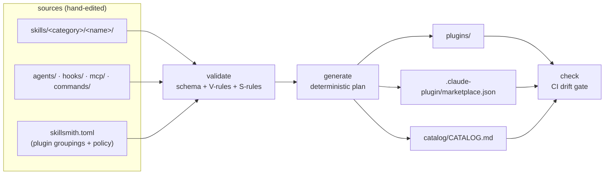

# skillsmith

A Claude Code skills monorepo where every installable artifact is **compiled from source** — plugins, the marketplace manifest, and the catalog are generated, validated, and drift-checked by the tool that lives in the same repo.

Skills rot in predictable ways: descriptions that never trigger, bodies that bloat the context window, scripts that ship unreviewed. This repo treats skills as sources run through a pipeline — schema validation, quality rules (V1–V14), security rules (S1–S7), trigger-hit-rate evals, and a CI drift gate — before anything reaches a consumer.

## Install the skills

```
/plugin marketplace add smithdak/skillsmith
/plugin install engineering-core@skillsmith-marketplace
```

Browse everything first in [catalog/CATALOG.md](catalog/CATALOG.md) — including the **script inventory** (path, interpreter, network flag, SHA-256) for every script a skill can execute. The security model is in [SECURITY.md](SECURITY.md).

### What's inside

| Plugin | Skills | Focus |
|---|---|---|
| **engineering-core** | `architecture-spec` · `codebase-survey` · `discovery-map` · `feature-spec` · `wizard` | Workflow orchestrators: specs, repo surveys, discovery planning, guided setup wizards |
| **code-craft** | `deep-modules` · `tdd` | Implementation discipline: test-driven red-green loops, deep-module interface design |
| **epistemics** | `falsification-review` · `ground-truth-research` · `research-note` + the `falsification-reviewer` agent | Judgment discipline: adversarial review, crux identification, live-source fact verification, durable research notes |
| **productivity-tools** | `cold-read` · `define-work-items` · `handoff` · `issue-triage` | Work discipline: self-sufficient documents, testable work items, structured handoffs, issue triage |

Skills compose across plugins (e.g. `architecture-spec` runs `falsification-review` as its verification pass); every edge is declared in frontmatter, enforced by rule V12, and listed in the catalog.

## How the repo works

The core invariant: **sources are hand-edited, artifacts are generated — never the reverse.**



If a generated file looks wrong, fix the source and rerun `generate` — `check` fails CI on any byte of drift. Generated output is deterministic: schema-defined JSON key order, sorted lists, LF endings, trailing newline.

`skillsmith.toml` assigns each skill to exactly one plugin and sets policy knobs: token caps, minimum trigger hit-rate (0.85), a network allowlist for scripts, and the composition allowlist.

## Development

Requires [Bun](https://bun.sh) ≥ 1.3.14. TypeScript runs directly — there is no build step.

```sh
bun install
bun test                                  # full suite (packages/core/test/)
cd packages/core && bunx tsc --noEmit     # typecheck
```

The CLI has no bin link in-repo; run the entry directly from the repo root:

```sh
bun packages/cli/src/main.ts validate --strict   # schema + quality + security tiers
bun packages/cli/src/main.ts generate            # emit plugins/, marketplace.json, catalog/
bun packages/cli/src/main.ts check               # drift gate: committed artifacts == generate output
bun packages/cli/src/main.ts eval                # trigger-hit-rate evals (needs ANTHROPIC_API_KEY)
```

Pre-PR gate — all three must pass: `validate --strict && generate && check`.

Package docs: [`packages/core`](packages/core/README.md) (the pipeline library — all logic lives here) and [`packages/cli`](packages/cli/README.md) (thin command wrapper).

Deep documentation lives in [`docs/`](docs/README.md): [architecture](docs/architecture.md), [skill authoring](docs/skill-authoring.md), the [validation rules reference](docs/validation-rules.md), [evals](docs/evals.md), and the [`skillsmith.toml` reference](docs/configuration.md).

## Authoring a skill

The five-step flow — short form in [CONTRIBUTING.md](CONTRIBUTING.md), full guide with the reasoning in [docs/skill-authoring.md](docs/skill-authoring.md):

1. **Scaffold** — `bun packages/cli/src/main.ts scaffold skill <name>` starts it in `skills/drafts/` (lenient: exempt from quality/security tiers, excluded from generation).
2. **Write** — goal, boundaries, and verification; not micro-checklists. Body ≤ 500 lines / ≈ 5000 tokens. Deterministic work goes in `scripts/`, on-demand docs in `references/` (one level deep).
3. **Evals** — `evals/evals.json` needs ≥ 3 should-trigger and ≥ 3 should-not-trigger cases, phrased the way real users type, not paraphrases of the description.
4. **Promote** — move the folder to `skills/engineering|productivity|misc/` and assign it to a plugin in `skillsmith.toml`.
5. **Gate** — `validate --strict && generate && check`.

The rules that bite most often: the description is the **trigger surface** (what it does *and* when, with quoted user phrasings — V3); never instruct the model to show or explain its reasoning (V13); never hand-edit generated files. Every rule, with fixes: [docs/validation-rules.md](docs/validation-rules.md).

## Repository map

```
skills/              skill sources, one folder per skill (SKILL.md + evals/ + scripts/ + references/)
  engineering/         architecture-spec, codebase-survey, deep-modules, discovery-map,
                       falsification-review, feature-spec, ground-truth-research,
                       research-note, tdd, wizard
  productivity/        cold-read, define-work-items, handoff, issue-triage
  misc/  drafts/       empty; drafts/ is the lenient staging area
agents/              agent sources (falsification-reviewer.md)
hooks/ mcp/ commands/  source slots, currently empty
skillsmith.toml      plugin groupings + policy — the assembly manifest
packages/core/       @skillsmith/core — discovery → validate → generate → check → eval
packages/cli/        skillsmith CLI — thin citty wrapper over core
docs/                deep documentation: architecture, authoring, rules, evals, config
plugins/             GENERATED installable plugins
.claude-plugin/      GENERATED marketplace.json
catalog/             GENERATED human-readable catalog with script inventory
.skillsmith/         editor JSON Schemas (written by init) + committed eval results (source)
```

## License

Each skill and generated plugin declares MIT in its own frontmatter/manifest. The repository does not yet carry a root `LICENSE` file — treat per-artifact declarations as authoritative until one lands.
