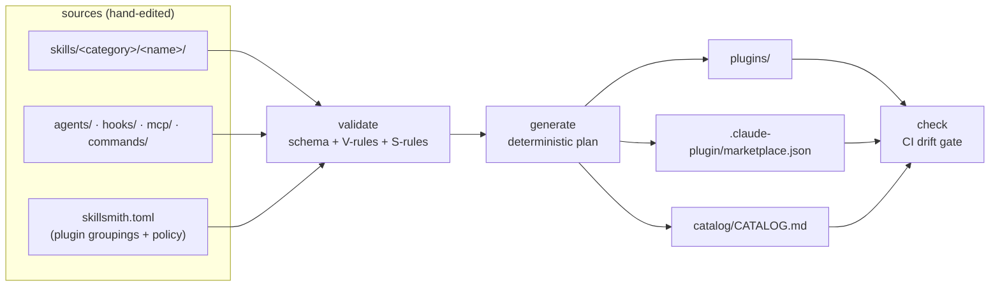

# skillsmith

[](https://github.com/smithdak/skillsmith/actions/workflows/ci.yml)
[](https://bun.sh)
[](catalog/CATALOG.md)
[](catalog/CATALOG.md)
[](LICENSE)

**A Claude Code skills monorepo where every installable artifact is compiled from source.** Plugins, the marketplace manifest, and the catalog are generated, validated, and drift-checked by the tool that lives in the same repo.

[Quick start](#quick-start) · [Plugins](#plugins) · [How it works](#how-it-works) · [Development](#development) · [Authoring a skill](#authoring-a-skill) · [Documentation](#documentation)

Skills rot in predictable ways: descriptions that never trigger, bodies that bloat the context window, scripts that ship unreviewed. skillsmith treats skills as **sources run through a pipeline** — schema validation, quality rules (V1–V14), security rules (S1–S7), trigger-hit-rate evals, and a CI drift gate — before anything reaches a consumer.

## Features

- **Compiled artifacts** — `plugins/`, `marketplace.json`, and the catalog are generated from `skills/` + `skillsmith.toml`, never hand-edited.
- **Deterministic output** — schema-defined JSON key order, sorted lists, LF endings. The same sources produce byte-identical artifacts on any platform.
- **Three validation tiers** — schema conformance, quality rules (V1–V14), and security rules (S1–S7), with warnings promotable to failures under `--strict`.
- **Profile-scoped diagnostics** — every finding declares which validators it applies to (`standard`, `claude-code`, `cowork`), because these enforce empirically different rules.
- **Trigger-hit-rate evals** — an LLM judge measures whether each skill actually fires on real user phrasings, gated at 0.85.
- **Script transparency** — every executable a skill ships is inventoried in the catalog with its interpreter, network-touching flag, and SHA-256.
- **Enforced plugin versioning** — CI fails if a plugin's shipped content changes without a version bump, because Claude Code refreshes installed plugins by version, not content.

## Quick start

```
/plugin marketplace add smithdak/skillsmith
/plugin install engineering-core@skillsmith-marketplace
```

> [!TIP]
> Browse everything first in **[catalog/CATALOG.md](catalog/CATALOG.md)** — it lists every skill, its composition edges, and the **script inventory** (path, interpreter, network flag, SHA-256) for anything a skill can execute. The security model is in [SECURITY.md](SECURITY.md).

## Plugins

Nine installable plugins, 37 skills, 2 agents. Install individually — a skill belongs to exactly one plugin.

| Plugin | Skills | What it's for |
|---|---|---|
| **engineering-core** `0.3.0` | `architecture-spec` · `codebase-survey` · `discovery-map` · `doc-visuals` · `feature-spec` · `information-architecture` · `skill-authoring` · `wizard` | Workflow orchestrators — specs, repo surveys, discovery planning, setup wizards — plus the structure and rendering disciplines they compose |
| **epistemics** `0.2.0` | `deep-research` · `falsification-review` · `ground-truth-research` · `research-note` + `falsification-reviewer` agent | Judgment discipline: adversarial review, crux identification, live-source verification, durable research notes |
| **security** `0.1.0` | `threat-model` · `security-diff-review` · `hardening-proposal` · `define-security-policy` | Repository threat modeling, diff-scoped review with sibling-instance sweeps, decision-ready hardening proposals |
| **productivity-tools** `0.1.0` | `cold-read` · `define-work-items` · `handoff` · `issue-triage` + `cold-reader` agent | Work discipline: self-sufficient documents, testable work items, structured handoffs |
| **code-craft** `0.1.0` | `deep-modules` · `tdd` | Implementation discipline: test-driven red-green loops, deep-module interface design |
| **frontend** `0.1.0` | `frontend-craft` · `frontend-redesign` | Build web UI that refuses generic AI-default patterns; non-destructively audit and upgrade an existing interface |
| **marketing** `0.2.0` | `brand-voice` · `content-angles` · `content-scorer` · `growth-experiments` · `outbound-builder` · `podcast-repurposer` · `seo-brief` | Content scoring, outbound sequences, angle research, repurposing, growth experiment design |
| **tldraw-canvas** `0.1.0` | `mermaid-to-tldraw` · `tldraw-animation` · `tldraw-diagram` · `tldraw-export` | Author editable `.tldr` files from a description, convert Mermaid to tldraw shapes, export canvases |
| **secrets-ops** `0.1.0` | `op-github-secrets` · `op-secrets` | 1Password-backed secrets: `op://` references with `op run`, and scoped service accounts for GitHub Actions |

Skills compose across plugins — `architecture-spec` runs `falsification-review` as its verification pass, `hardening-proposal` pressure-tests its recommendation the same way. Every edge is declared in frontmatter, enforced by rule V12, and listed in the catalog.

## How it works

The core invariant: **sources are hand-edited, artifacts are generated — never the reverse.**


```mermaid
flowchart LR
    subgraph sources["sources (hand-edited)"]
        A["skills/&lt;category&gt;/&lt;name&gt;/"]
        B["agents/ · hooks/ · mcp/ · commands/"]
        C["skillsmith.toml<br/>(plugin groupings + policy)"]
    end
    A & B & C --> V["validate<br/>schema + V-rules + S-rules"]
    V --> G["generate<br/>deterministic plan"]
    G --> P["plugins/"]
    G --> M[".claude-plugin/marketplace.json"]
    G --> K["catalog/CATALOG.md"]
    P & M & K --> D["check<br/>CI drift gate"]
```

> [!IMPORTANT]
> Never hand-edit `plugins/`, `.claude-plugin/marketplace.json`, `catalog/`, or `.skillsmith/schemas/`. If a generated file looks wrong, fix the source and rerun `generate` — `check` compares committed bytes against the plan `generate` would write and fails CI on any drift.

`skillsmith.toml` assigns each skill to exactly one plugin and sets the policy knobs: token caps, minimum trigger hit-rate (0.85), a network allowlist for scripts, and the cross-plugin composition allowlist.

> [!WARNING]
> Changing a plugin's shipped content **requires bumping its `version`** in `skillsmith.toml` — installed plugins refresh by version, not content, so an unbumped change never reaches users. `version-guard` enforces this in CI against the base branch.

## Development

Requires [Bun](https://bun.sh) ≥ 1.3.14. TypeScript runs directly — there is no build step.

```sh
bun install
bun test                                  # full suite (packages/core/test/)
cd packages/core && bunx tsc --noEmit     # typecheck
```

The CLI has no bin link in-repo; run the entry directly from the repo root:

| Command | What it does |
|---|---|
| `validate --strict` | Schema + quality (V) + security (S) tiers; warnings become failures |
| `generate` | Emit `plugins/`, `marketplace.json`, `catalog/` |
| `check` | Drift gate — committed artifacts must equal `generate` output |
| `version-guard --base origin/main` | Fail if a plugin's content changed without a version bump |
| `scaffold skill <name>` | New skill in `skills/drafts/` |
| `eval` | Trigger-hit-rate evals against each skill's `evals/evals.json` |

```sh
bun packages/cli/src/main.ts validate --strict
```

> [!NOTE]
> `eval` calls the Anthropic API and needs `ANTHROPIC_API_KEY` (Bun auto-loads a gitignored repo-root `.env`). It is manual-dispatch only in CI — the judge is non-deterministic and costs real money.

**Pre-PR gate** — all three must pass: `validate --strict && generate && check`.

## Authoring a skill

Short form in [CONTRIBUTING.md](CONTRIBUTING.md); the full guide with reasoning is in [docs/skill-authoring.md](docs/skill-authoring.md).

1. **Scaffold** — `scaffold skill <name>` starts it in `skills/drafts/` (lenient: exempt from quality and security tiers, excluded from generation).
2. **Write** — goal, boundaries, and verification; not micro-checklists. Body ≤ 500 lines / ≈ 5000 tokens. Deterministic work goes in `scripts/`, on-demand docs in `references/` (one level deep).
3. **Evals** — `evals/evals.json` needs ≥ 3 should-trigger and ≥ 3 should-not-trigger cases, phrased the way real users type, not paraphrases of the description.
4. **Promote** — move the folder to `skills/engineering|productivity|misc/` and assign it to a plugin in `skillsmith.toml`.
5. **Gate** — `validate --strict && generate && check`.

> [!IMPORTANT]
> The rules that bite most often: the description is the **trigger surface** — what the skill does *and* when, with quoted user phrasings (V3); never instruct the model to show or explain its reasoning (V13); never hand-edit generated files. Every rule with its fix: [docs/validation-rules.md](docs/validation-rules.md).

The repo also ships a `skill-authoring` skill that encodes this discipline — install `engineering-core` and it applies while you write.

## Repository map

```text
skills/                  skill sources — one folder per skill
  engineering/           26 skills: specs, surveys, review, security, frontend, tldraw, secrets
  misc/                  7 skills: the marketing set
  productivity/          4 skills: cold-read, define-work-items, handoff, issue-triage
  drafts/                lenient staging area — schema checks only, never generated
agents/                  agent sources (cold-reader, falsification-reviewer)
hooks/ mcp/ commands/    empty source slots
skillsmith.toml          plugin groupings + policy — the assembly manifest
packages/
  core/                  @skillsmith/core — the whole pipeline, and its test suite
  cli/                   skillsmith CLI — thin citty wrapper over core
docs/                    architecture, authoring, validation rules, evals, config
plugins/                 GENERATED installable plugins
.claude-plugin/          GENERATED marketplace.json
catalog/                 GENERATED catalog with per-script inventory
.skillsmith/             schemas/ GENERATED + eval-results.json (committed source)
```

Each skill folder holds `SKILL.md` plus optional `evals/`, `scripts/`, and `references/` — anatomy in [docs/skill-authoring.md](docs/skill-authoring.md).

## Documentation

| Document | Contents |
|---|---|
| [docs/architecture.md](docs/architecture.md) | Pipeline design, module boundaries, why diagnostics are profile-scoped |
| [docs/skill-authoring.md](docs/skill-authoring.md) | Full authoring guide — anatomy, descriptions, references, scripts |
| [docs/validation-rules.md](docs/validation-rules.md) | Every V and S rule with the fix for each |
| [docs/evals.md](docs/evals.md) | How trigger-hit-rate measurement works and how to read results |
| [docs/configuration.md](docs/configuration.md) | `skillsmith.toml` reference — groupings and policy knobs |
| [packages/core](packages/core/README.md) · [packages/cli](packages/cli/README.md) | Package-level docs (all logic lives in core) |
| [SECURITY.md](SECURITY.md) · [NOTICES.md](NOTICES.md) | Security model; third-party attribution for adapted skills |
