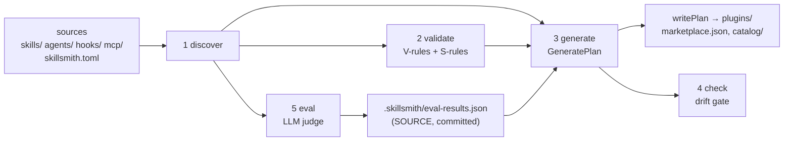

# Architecture — how sources become artifacts

skillsmith is a compiler for skills: hand-edited sources go in, deterministic
installable artifacts come out, and CI refuses any artifact that wasn't
produced by the pipeline. This document explains the stages, the invariants
that hold them together, and the design decisions a contributor needs before
changing `packages/core`.

## The three invariants

1. **I1 — sources are hand-edited, artifacts are generated, never the reverse.**
   Sources: `skills/`, `agents/`, `hooks/`, `mcp/`, `commands/`, `skillsmith.toml`.
   Generated: `plugins/`, `.claude-plugin/marketplace.json`, `catalog/CATALOG.md`,
   `.skillsmith/schemas/`. If a generated file looks wrong, fix the source and
   rerun `generate`.
2. **I2 — the drift gate is byte-exact.** `check` compares committed artifacts
   against the *same plan bytes* `generate` would write — not a re-implementation,
   the identical `GeneratePlan` ([`generate.ts`](../packages/core/src/generate.ts),
   [`check.ts`](../packages/core/src/check.ts)). This only works because
   generation is deterministic (below).
3. **I3 — volatile surface data is data.** Everything that tracks a Claude Code
   behavior that can change per minor release — schema target, length limits,
   known hook events, proven agent toolsets — lives in
   [`constants.ts`](../packages/core/src/constants.ts) and nowhere else. When
   Claude Code changes, that file is the single edit point.

## The pipeline

| Stage | Module | Contract |
|---|---|---|
| 1. Discover | [`discovery.ts`](../packages/core/src/discovery.ts) | The **only** module that scans the filesystem for reads. Globs `skills/*/*/SKILL.md`, `agents/**/*.md`, `hooks/*/hooks.json`, `mcp/*.mcp.json`; skill and agent frontmatter is schema-validated at parse time; hook and MCP file contents are read raw here and validated downstream (hooks in stage 2, MCP at generate-time merge); returns sorted `DiscoveryResult`. |
| 2. Validate | [`validate.ts`](../packages/core/src/validate.ts) + [`composition.ts`](../packages/core/src/composition.ts) | Quality (V) and security (S) rules that need file *contents* — bodies, scripts, references, evals, hook sets. Also produces two artifacts consumed downstream: the per-skill **script inventory** (path, interpreter, network flag, SHA-256) and the declared **composition edges**. |
| 3. Generate | [`generate.ts`](../packages/core/src/generate.ts) | Pure function `(DiscoveryResult, SkillsmithConfig) → GeneratePlan` — a map of repo-relative path → content plus a source→dest copy list. No I/O; `writePlan()` applies it to disk. |
| 4. Check | [`check.ts`](../packages/core/src/check.ts) | Diffs the plan against the working tree. Three drift classes: **missing** (plan owns a path that doesn't exist), **modified** (bytes differ), **stale** (a file inside generated territory — `plugins/`, `catalog/`, `.claude-plugin/`, `.skillsmith/schemas/` — the plan no longer owns). No behavior-altering flags by design (`--cwd`/`--json` only). |
| 5. Eval | [`eval.ts`](../packages/core/src/eval.ts) | LLM-judge trigger evals — the one intentionally non-deterministic stage. See [Evals](evals.md). |

Supporting modules: [`catalog.ts`](../packages/core/src/catalog.ts) renders
`CATALOG.md` from plan inputs; [`scaffold.ts`](../packages/core/src/scaffold.ts)
builds init/scaffold file sets (never overwrites); [`diagnostics.ts`](../packages/core/src/diagnostics.ts)
is the finding model; [`schemas/`](../packages/core/src/schemas/) holds a zod v4
schema per source shape.

## Why determinism is load-bearing

`check` can only be a trustworthy CI gate if `generate` produces identical
bytes on every machine, every run. The rules, all in
[`generate.ts`](../packages/core/src/generate.ts) and its callees:

- **JSON key order is schema-defined**, not insertion-order: manifests are
  built by constructing objects field-by-field in the schema's order, then
  `canonicalJson()` (2-space indent, LF, trailing newline).
- **Every list is sorted** before rendering — skills, agents, plugins, files,
  composition edges, catalog rows.
- **Text files end in exactly one newline; line endings are LF** — on Windows
  too (this repo's history has a commit stripping CR from wizard input for the
  same reason).

The one deliberate exception: **eval output is non-deterministic**, so it is
treated as a *source*, not an artifact — `.skillsmith/eval-results.json` is
committed, consumed by `generate` for catalog badges, and only changes when a
human reruns `eval`. Its `runDate` has day precision so same-day reruns stay
byte-stable ([`eval.ts`](../packages/core/src/eval.ts) defines the contract;
the CLI stamps the date).

## The diagnostics model

Every finding carries four things ([`diagnostics.ts`](../packages/core/src/diagnostics.ts)):
a rule id (`V1`–`V14`, `S1`–`S7`, `SCHEMA`), a path-anchored location, a
severity, and the set of **profiles** it applies to.

Profiles exist because the three validators this repo targets empirically
enforce *different* rules:

- `standard` — the Agent Skills open standard (agentskills.io), the portable subset;
- `claude-code` — `claude plugin validate --strict` semantics;
- `cowork` — the Cowork `.plugin` importer, stricter than the CLI.

Example: `argument-hint` in SKILL.md frontmatter is fine in Claude Code but
fails the Cowork importer, so the finding is an error scoped to `cowork` only.
`forProfile()` filters findings; `exitCode()` maps them to process exits —
errors always fail, warnings fail only under `--strict`. Every CLI command
shares these semantics (exit 0 clean, 1 findings/drift, 2 usage/environment).

Two deliberate asymmetries in strictness:

- **Anthropic-owned surfaces are tolerant**: unknown frontmatter/manifest
  fields warn, because the Claude Code surface churns faster than this tool
  releases.
- **skillsmith's own surfaces are strict**: unknown keys in `skillsmith.toml`
  or `evals.json` are hard errors ([`skillsmith-config.ts`](../packages/core/src/schemas/skillsmith-config.ts),
  [`schemas/evals.ts`](../packages/core/src/schemas/evals.ts)).

## The schema layers

SKILL.md frontmatter is validated in two layers
([`agent-skills-standard.ts`](../packages/core/src/schemas/agent-skills-standard.ts),
[`claude-code-frontmatter.ts`](../packages/core/src/schemas/claude-code-frontmatter.ts)):

1. **Layer 1 — the open standard**: `name`, `description`, `license`,
   `compatibility`, `metadata`, `allowed-tools`. Loose object: unknown keys
   pass through so layer 2 decides unknown-field policy. Pinned to
   `STANDARD_TARGET` (`agent-skills@2025-12`).
2. **Layer 2 — Claude Code extensions**: `when_to_use`, `argument-hint`,
   `disable-model-invocation`, `user-invocable`, `model`, `effort`,
   `context: fork`, `hooks`, and friends. Pinned to `SCHEMA_TARGET`
   (`claude-code@2.1.x`). This layer churns; that is why it is a separate file
   and why its limits live in `constants.ts`.

`generateJsonSchemas()` ([`schemas/json-schemas.ts`](../packages/core/src/schemas/json-schemas.ts))
exports six zod schemas as JSON Schema — skill frontmatter, plugin manifest,
marketplace, skillsmith config, evals, hooks — emitted into
`.skillsmith/schemas/` by `generate` (drift-guarded like any artifact; `init`
seeds them plus the `.vscode` associations that point at them).

## Where things run

- `packages/cli` ([README](../packages/cli/README.md)) is deliberately
  zero-logic: load config, call core, print diagnostics, exit. If a change
  involves a decision, it belongs in core — the CLI has no tests *because*
  there is nothing to test.
- `packages/core` ([README](../packages/core/README.md)) holds everything and
  the entire test suite (`packages/core/test/`). Tests inject a deterministic
  judge for eval and use fixture repos for generate/check round-trips.
- CI ([`.github/workflows/ci.yml`](../.github/workflows/ci.yml)) runs
  `validate --strict` → `check` → `bun test` → `tsc --noEmit` on pushes to
  `main` and on every PR. Evals run only on manual dispatch
  ([`.github/workflows/eval.yml`](../.github/workflows/eval.yml)) — they call
  the Anthropic API and cost real money.

## Reading order for a new contributor

1. [`diagnostics.ts`](../packages/core/src/diagnostics.ts) — the finding model everything returns.
2. [`discovery.ts`](../packages/core/src/discovery.ts) — what a "source" is once parsed.
3. [`generate.ts`](../packages/core/src/generate.ts) — how a plan is assembled.
4. [`check.ts`](../packages/core/src/check.ts) — why the gate is trustworthy.
5. [`validate.ts`](../packages/core/src/validate.ts) + the [rules reference](validation-rules.md) — the quality/security surface.
